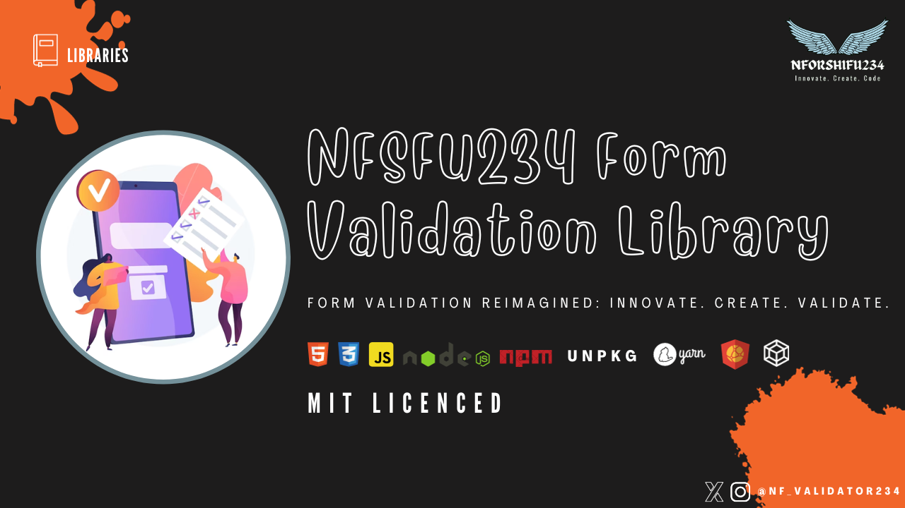

# 📚 NFSFU234 Form Validation Library

[](https://github.com/NFSFU234FormValidation/nfsfu234-form-validation/blob/main/LICENSE)
[](https://www.npmjs.com/package/nfsfu234-form-validation)


[](https://www.jsdelivr.com/package/npm/nfsfu234-form-validation)
[](https://socket.dev/npm/package/nfsfu234-form-validation)



Hey there! 👋 Welcome to the 📜 NFSFU234 Form Validation repository!

🚨 **Important Notice:** 🚨 This repository has been moved to its own organization account! 🎉

🔗 **New Location:** [NFSFU234FormValidation/nfsfu234-form-validation](https://github.com/NFSFU234FormValidation/nfsfu234-form-validation)

## What's NFSFU234 Form Validation?

NFSFU234 Form Validation is a lightweight and user-friendly JavaScript library designed for validating HTML form elements, with a special emphasis on textarea fields. It offers customizable validation messages, comprehensive support for required field checks, seamless inline error displays, and convenient modal error notifications.

## Features 🚀

- Easy-to-use API
- Customizable validation rules
- Support for various input types
- Lightweight and fast

## Installation 🛠️

To use the library in your project, there are two ways to include NFSF234 Form Validation JS Library:

## ☁️ Using The CDN URL

If you're looking to employ the form validation library in your browser environment, simply include the following URLs within the `<head>` tag of your HTML code:

```html
<!-- NFSFU234FormValidation CSS CDN -->
<link rel="stylesheet" href="https://cdn.jsdelivr.net/npm/nfsfu234-form-validation@latest/dist/css/nfsfu234FormValidation.min.css">

<!-- NFSFU234FormValidation JS CDN -->
<script src="https://cdn.jsdelivr.net/npm/nfsfu234-form-validation@latest/dist/js/nfsfu234FormValidation.js"></script>
```

If you encounter any issues with certain functions using the `@latest` tag, it might not include the most recent updates. In such cases, consider using a more specific version number, such as `X.x.x` or `major.minor.patch` `(e.g,. 2.4.3)`, to ensure you have access to the latest features and bug fixes:

```html
<!-- NFSFU234FormValidation CSS CDN (Specific Version) -->
<link rel="stylesheet" href="https://cdn.jsdelivr.net/npm/nfsfu234-form-validation@X.x.x/dist/css/nfsfu234FormValidation.min.css">

<!-- NFSFU234FormValidation JS CDN (Specific Version) -->
<script src="https://cdn.jsdelivr.net/npm/nfsfu234-form-validation@X.x.x/dist/js/nfsfu234FormValidation.js"></script>
```

This way, you can enjoy the benefits of the NFSFU234 Form Validation library with confidence in the version you're utilizing. 🌐📦

## ⚙️ Install it via console:

If your preferred method involves `npm`, `yarn`follow these simple steps to integrate the NFSFU234 Form Validation library into your project:

1. In your terminal, navigate to the desired project directory.

### NPM

2. Execute the following npm command to install the library:

```bash
npm install nfsfu234-form-validation --save
```
### YARN

2. Execute the following yarn command to install the library:

```bash

yarn add nfsfu234-form-validation

```

By executing this command, you're well on your way to enjoying the benefits of the NFSFU234 Form Validation library. 📦🚀

## 🏁 Initialization

To harness the power of the NFSFU234 Form Validation library, you must first create an instance of the library with the appropriate parameters. Below are illustrative examples showcasing how to forge an instance with form particulars and AJAX options.

### Example 1: Elementary Embarkation

In this scenario, we'll craft a straightforward NFSFU234 Form Validation instance sans any supplementary parameters. The library will adeptly detect the form with the ID 'jsSubmit' and inaugurate the validation process.

```javascript
// Create a fundamental NFSFU234 Form Validation instance
const formValidator = new NFSFU234FormValidation();
```

### Example 2: Customized Form Insights and AJAX Artistry

This exemplar unveils the creation of a bespoke NFSFU234 Form Validation instance, replete with tailored form specifics and AJAX orchestrations.

```javascript
// Example custom error messages for your form
const customErrorMessages = {
  "text": "EMPTY FIELD",
  "select": "SELECT FIELD IS REQUIRED",
  "email": {
    "empty": "EMPTY EMAIL",
    "format": "The email is not in the right format",
  },
  // ... Other field types and messages
};

// Example form details object
const formDetails = {
  form: "myForm", // Replace "myForm" with the ID of your form or the actual HTML element of your form (recommended)
  isErrorMessageInline: true,
  customErrorMessages: customErrorMessages,
};

// Example AJAX options object
const ajaxOptions = {
  url: "login.php",
  RequestMethod: "POST",
  RequestHeader: {
    "Content-Type": "application/json",
  },
};

// Forge a customized NFSFU234 Form Validation instance
const formValidator = new NFSFU234FormValidation(formDetails, ajaxOptions);
```

In the second example, we furnish tailor-made error messages for the form fields and outline AJAX options for form submission. This approach empowers granular customization and mastery over the validation and form submission processes.

**Note:** If you initialize an instance of the NFSFU234 Form Validation Library without providing parameters, it will seamlessly detect the form with the ID 'jsSubmit' or the first form on the page in the absence of a form ID. This streamlined approach suits scenarios where you're working with a single form and prefer a simplified setup without additional configurations. 🚀👨‍💻

## Get Started 🎉

Ready to get started with NFSFU234 Form Validation? Head over to the new repository and join me in building awesome things together!

🔗 [Go to the new repository](https://github.com/NFSFU234FormValidation/nfsfu234-form-validation)

## Social Media 🌐

Follow us on social media for updates, tips, and more:

- X (Twitter): [@nf_validator234](https://x.com/nf_validator234)
- Instagram: [@nf_validator234](https://instagram.com/nf_validator234)
- Website: [NFSFU234FormValidation](https://nfsfu234-form-validation.netlify.app/)

## Contributing 🤝

We welcome contributions from everyone! Check out our new repository for guidelines on how to contribute.

---

🔧 **Note:** This README is hosted on my personal GitHub account. Please refer to the new repository for the latest updates and contributions. Thanks! 😊
